# multi-token-proactive-market-maker

note: This is a continuation of a group project from summer 2022, and I am now working on it by myself

## Running the code

1. Modify the config JSONs. They follow this form:
```json
{
    "initializer": {
        "init_kwargs": {
            "constant": "// approximate pool size",
            "k": "// k parameter for PMM, MPMM if it is not set randomly",
            "cap_limit": "// market cap of any single token",
            "random_k": "// 'True' if k parameters set randomly for PMM, MPMM"
        },
        "token_configs": {
            "token_infos": {
                "traffic_gen": {
                    "// token name, optional entry": {
                        "intype_percent": "// percentage of swaps depositing this token, optional entry",
                        "outtype_percent": "// percentage of swaps removing this token, optional entry"
                    }
                },
                "price_gen": {
                    "// token name": {
                        "start": "// start price",
                        "mean": "// mean % price change, optional entry (default in 'price_gen')",
                        "stdv": "// stdv of price change, optional entry (default in 'price_gen')",
                        "change_probability": "// probability of price change, optional entry (default in 'price_gen')"
                    }
                }
            }
        }
    },
    "traffic": {
        "init_kwargs": {
            "sigma": "// stdv of swap amount (wrt an actual currency)",
            "mean": "// average swap amount (wrt an actual currency)",
            "arb_probability": "// percent of swaps that are purely for arbitrage",
            "shape": "// [num of batches, batch size]; prices change between batches",
            "max_price": "// maximum amount of any swap (wrt an actual currency)",
            "is_norm": "// 'True' if swap amount is normally distributed (else it's uniform from (0, max_price))"
        }
    },
    "price_gen": {
        "init_kwargs": {
            "mean": "// average % of price change",
            "stdv": "// stdv of price change",
            "change_probability": "// probability of price changing",
            "batches": "num of batches; should match with 'shape' in 'traffic'"
        }
    },
    "market_maker": {
        "type": "// market maker type (AMM, CSMM, etc)",
        "simulate_kwargs": {
            "reset_tx": "// 'True' if reset pool states after each batch",
            "arb": "// 'True' if arbitrage should be simulated",
            "arb_actions": "// number of swaps per arbitrage action",
            "multi_token": "// 'True' if market maker has multi token pools (name begins with M)"
        }
    }
}
```

2. ```python simulator.py```

## Multi-token proactive market maker

The proactive market maker, or PMM, was first implemented by [DODO Exchange](https://docs.dodoex.io/english/dodo-academy/pmm-overview/the-mathematical-principle-of-pmm). PMM generalizes the commonly used constant product market maker by introducing a parameter $k$ to change the "flatness" of the pricing curve and splitting the pool state curve into 2. Coupled with access to a price oracle, this gave PMM several novel features:

1. Can change the pricing curve's "slope" to increase capital efficiency (low $k$, near 0) or to counter volatility (high $k$, near 1)
2. Can set an equilibrium pool state/point where the exchange rate is given by the market rate (i.e. the rate derived from dividing the prices of 2 tokens), thus ensuring most swaps happen near market rates
3. Can change the equilibrium point depending on the pool state and current market exchange rate to reduce impermanent loss
4. Single token type deposits for liquidity providers

The motivation for designing a multi-token version of PMM, or MPMM, was driven by the following 2 hypotheses:

1. The effectiveness increasing capital efficiency by setting a low $k$ is dependent on the amount of pool liquidity. Increasing liquidity results in a locally flatter price curve, so there is a greater range of pool states where swapping can happen near market exchange rates.
2. Combining all tokens in a single pool allows more opportunities to adjust equilibrium points to combat impermanent loss.

In implementing MPMM, the biggest challenge was creating a multi-token equivalent to the method used in PMM to establish equilibrium points. Most automated market makers use a 2-d curve to represent all pool states, so it might seem reasonable to have a multi-dimension surface represent pool states for the multi-token setting. However, this is computationally expensive, especially for use on a blockchain. Maintaining a flexible parameter $k$ and allowing single token type deposits, which is a consequence of the split pricing curve, would require the number of computations to at least be on the order of number of tokens in the pool. Instead, MPMM sets the equilibrium point for each swap by minimizing the following expression:

$$(1 - \frac{s}{S})^2 + (1 - \frac{l}{L})^2$$

$l$ and $L$ are the current balance and liquidity provider deposit amount of the first token, respecitvely, and $s$ and $S$ are the current balance and liquidity provider deposit amount of the second token, respecitvely. $L$ and $S$ are always known, and $s$ is a function of $l$ that conforms to the price curve given by PMM. So, in reality, this optimization is solely with respect to $l$.

## Analyzing results: capital efficiency and price impact

The simulations provide estimates on the relative capital efficiency, price impact, and impermanent loss performance of several market makers. Data is gathered from running many simulated swaps. AMM refers to the constant product market maker, CSMM refers to constant sum market maker, and PMM refers to proactive market maker. Their counterparts (MAMM, MCSMM, and MPMM) are, respectively, the multi-token pool counterparts.

We first begin by looking at capital efficiency data.

raw results            |  processed results (remove outliers)
:-------------------------:|:-------------------------:
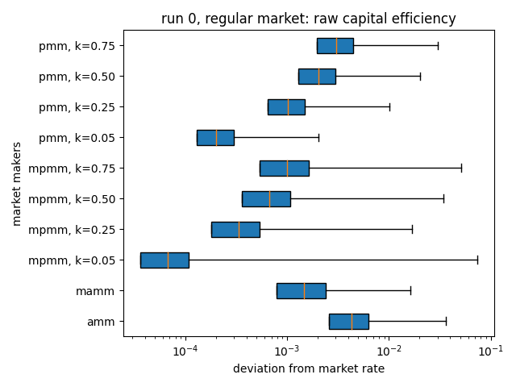  |  
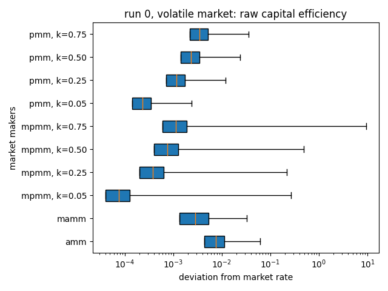  |  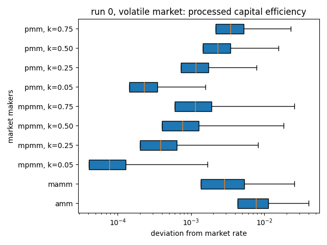

These are the results represented as box and whiskers plots. The minimums were removed to make the plots more readable since they usually were very close to 0. CSMM and MCSMM were also removed, as they always process swaps at market rates. Capital efficiency was determined by finding the magnitude of percentage difference between the market rate and the swap rate.

As expected, combining liquidity spread out over many two-token pools into one large source per token increases capital efficiency. This is true when comparing all pairwise-token and multi-token pairs. Additionally, we see the effects of the $k$ parameter and the settable equilibrium point translate over to the multi-token setting. Specifically, lower $k$ improves capital efficiency in both PMM and MPMM, and MPMM is more performant than MAMM. This confirms the first hypothesis.

We can also observe a similar pattern looking at the price impact data.

raw results            |  processed results (remove outliers)
:-------------------------:|:-------------------------:
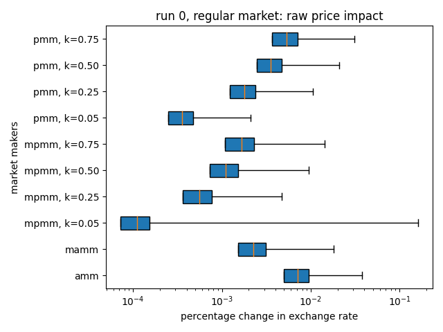  |  
  |  

Price impact was measured by pretending to execute a swap once more after a simulated swap executed and measuring the change in the exchange rate between this hypothetical swap and the one that actually occurred.

Price impact and capital efficiency are closely related since they both measure the capacity to handle a "large" swap. These results reaffirm the first hypothesis.

## Analyzing results: impermanent loss

raw results            |  processed results (remove outliers)
:-------------------------:|:-------------------------:
  |  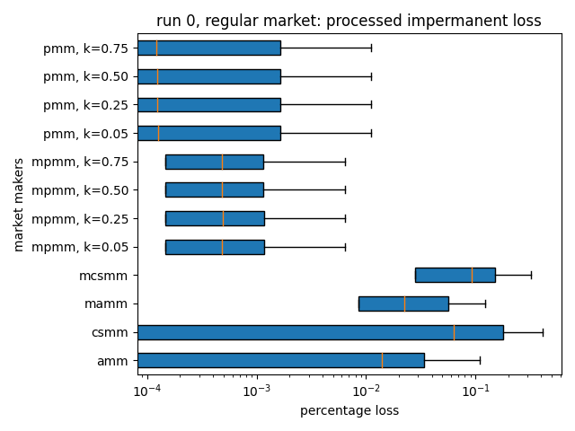
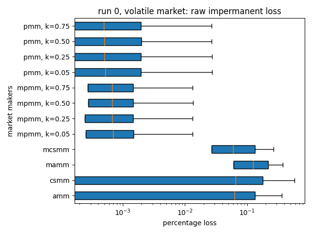  |  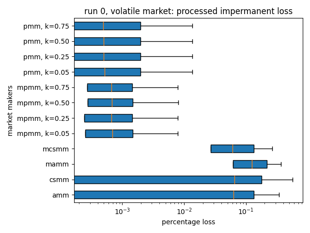

Impermanent loss was calculated by measuring the proportionate magnitude of all negative changes in token balances with respect to initial balances. This was calculated for each token type individually and after each swap. The results show that most multi-token variants perform slightly worse than their single-token counterparts, at least when comparing medians. That said, the multi-token platforms do have less variance.

An interesting scenario is to look at impermanent loss when a token's price suddenly drops.

AMM            |  MAMM
:-------------------------:|:-------------------------:
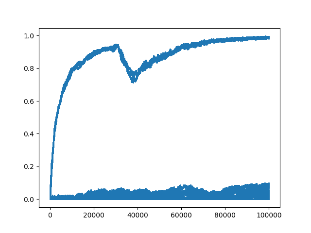  |  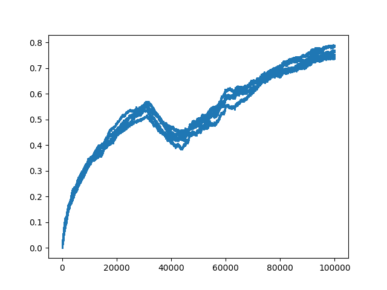

CSMM            |  MCSMM
:-------------------------:|:-------------------------:
  |  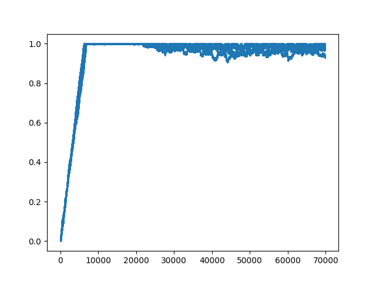

PMM            |  MPMM
:-------------------------:|:-------------------------:
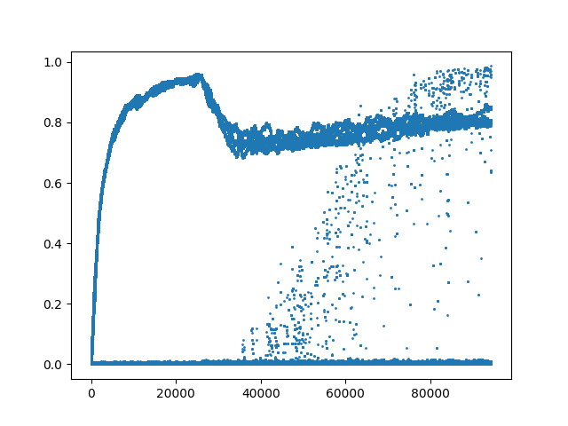  |  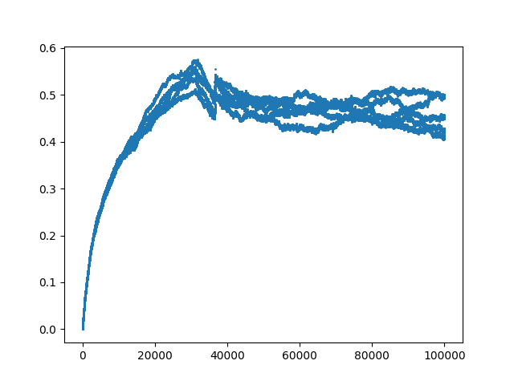

We notice that the multi-token market maker variants experience significant losses across all token types, while this only occurrs for a select few pools in the pairwise token pool variants. This is simply because the pairwise-token format protects all token pools that do not contain the crash type from the effects of a crash whereas this protection does not exist in the multi-token setting. Another observation is that multi-token pools take longer to reach the maximum impermanent loss. This is explained by the fact that multi-token market makers have more effective liquidity such that proportionate losses take longer to accumulate.

## Other observations

TODO
